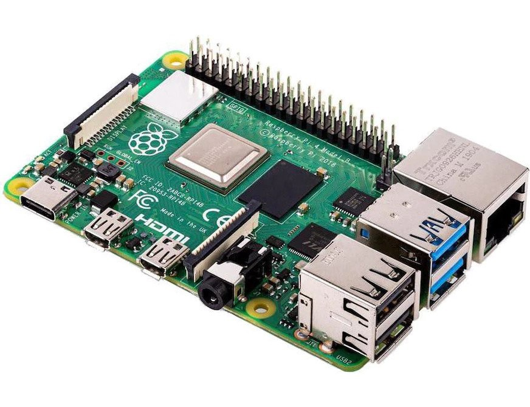
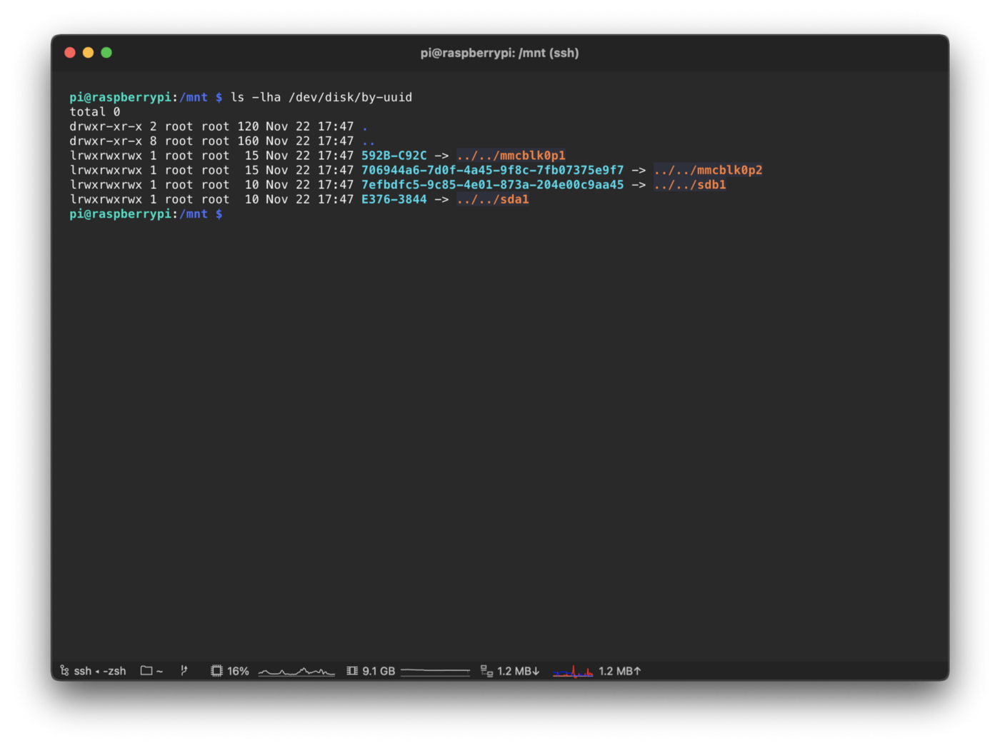
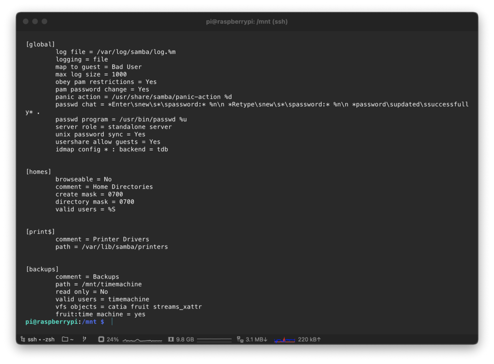
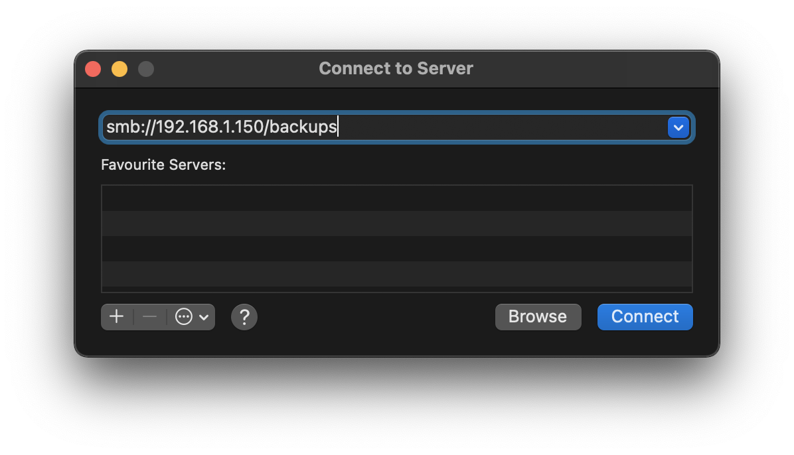
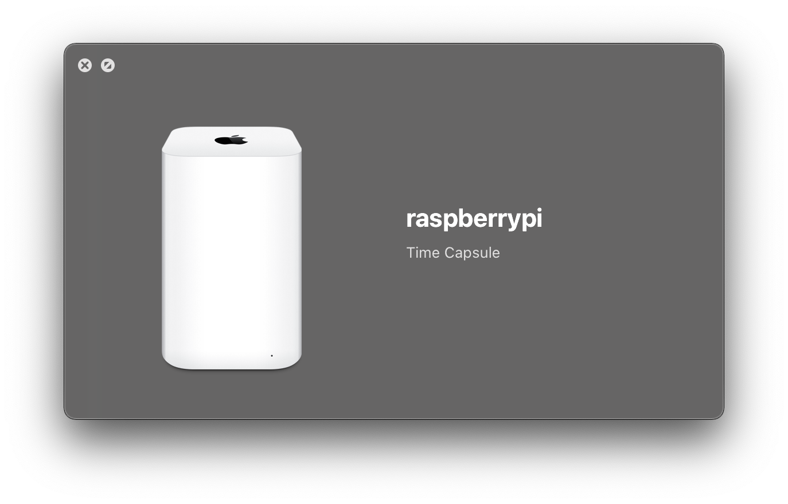
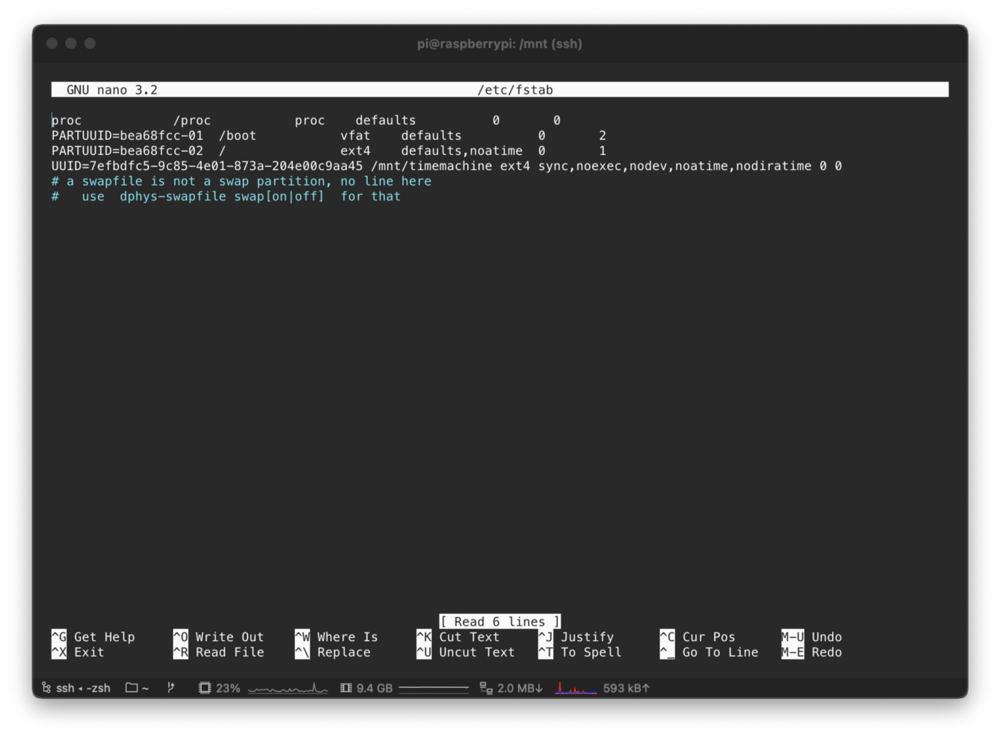
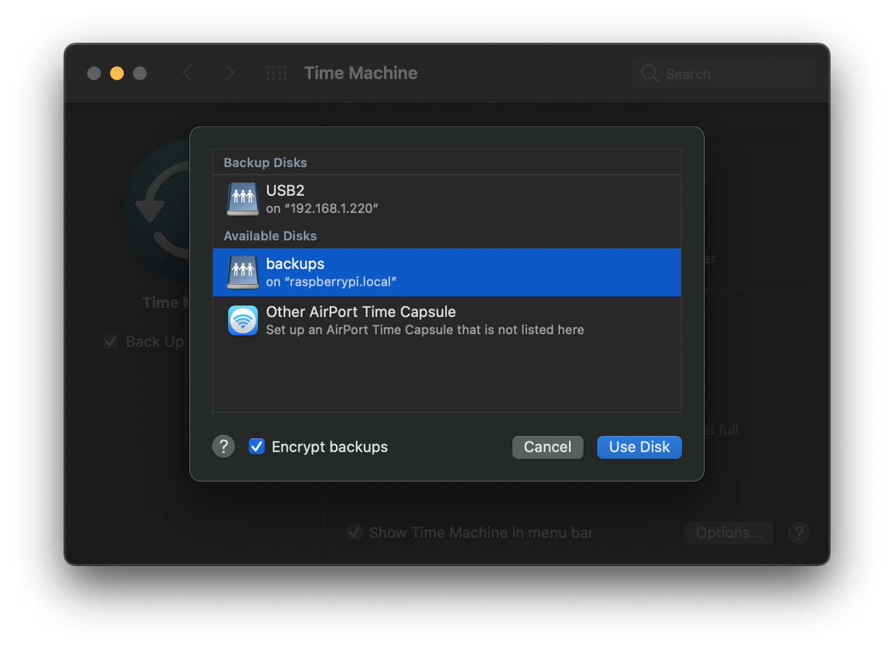
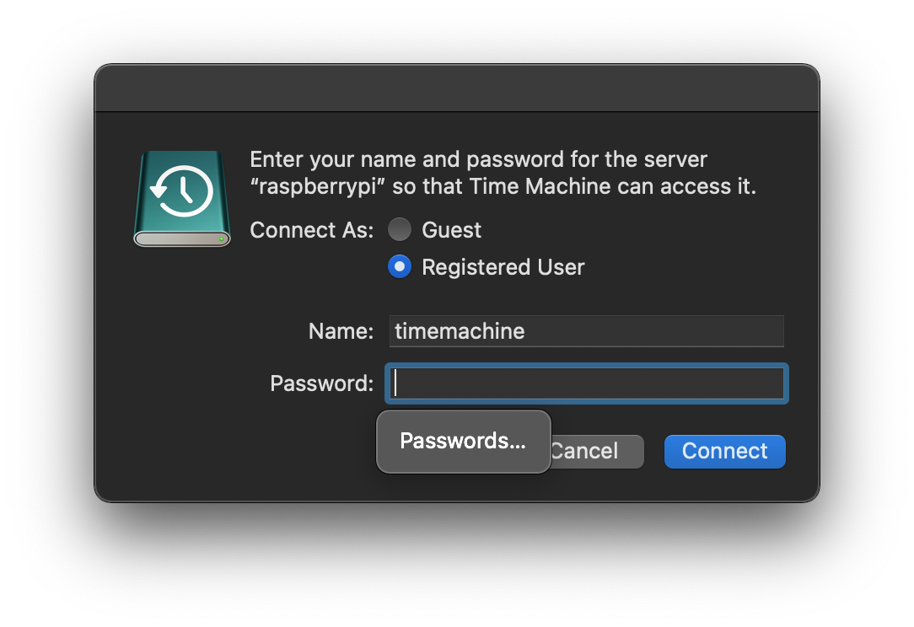
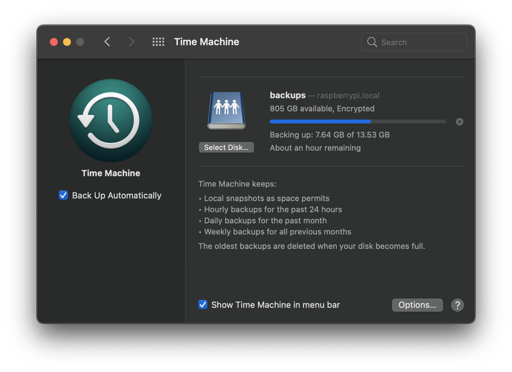

# Time Machine/Time Capsule - But on your Raspberry pi

Time Machine is built into the system of macOS, and I’ve been using it since the early days of Mac OS X Leopard. If you have a Raspberry Pi (or two) lying around at your place like me, this tutorial comes in handy to create a cheap and speedy backup solution.



## Preparation

### Update system software

Make sure your Raspberry Pi is running on the latest software.

```bash
sudo apt-get update && sudo apt-get upgrade
```

### Install Samba

We’re going first to install Samba (for SMB), a prevalent Open Source file sharing protocol that Time Machine officially supports for backing up data over a network. The Avahi daemon is used for Apple's “Bonjour” mDNS protocol, and our Raspberry Pi server is automatically discoverable within the network.

```bash
sudo apt-get install samba avahi-daemon
```

## Storage

### Connect Hard drive to USB 3.0 port

As the Raspberry Pi 4 ships with 2x USB 3.0 ports, we can connect an external hard drive as our disk space for backing up data. Also, we should get decent speeds as we get a 1GBit/s wired connection with the Pi 4.

### Determine the device ID (UUID) of your USB drive

```bash
ls -lha /dev/disk/by-uuid
```



Look for the UUID and remember the mount point (e.g.,/dev/sdb1). We’ll need this later.

In my case, the device was _/dev/sdb1_, and the UUID we’re looking for was the one below:

```text
7efbdfc5–9c85–4e01–873a-204e00c9aa45
```

>Note: exchange this UUID with yours

### Create backup user

```bash
sudo adduser timemachine
```

It will ask you to set a password for your newly created user.

### **Set a password**

```bash
sudo smbpasswd -a timemachine
```

### Create the mount point

We need to create a folder where Linux can mount our device to the USB hard drive.

```bash
sudo mkdir /mnt/timemachine
```

### Mount device

We’ll now mount the USB drive to the previously created mount point.

```bash
sudo mount /dev/sdb1 /mnt/timemachine
```

> Note that you’ll need to exchange /dev/sdb1 with your device (see the Step with the UUID above which letter your device uses)

### Take ownership

To allow our backup user to write on the device, we’ll need to take over the ownership of the mount point:

```bash
sudo chown -R timemachine: /mnt/timemachine
```

### Configuring Samba

Edit the Samba configuration file:

```bash
sudo nano /etc/samba/smb.conf
```

Add the following to the end:

```conf
[backups]    
    comment = Backups    
    path = /mnt/timemachine    
    valid users = timemachine    
    read only = no    
    vfs objects = catia fruit streams_xattr    
    fruit:time machine = yes
```

This will create a network drive called “_backups_” which we’ll use for Time Machine.

### Test Samba configuration

```bash
sudo testparm -s
```



If all goes well, you should get an output like this.

### Restart service

Not let’s restart the service to make sure our changes are active.

```bash
sudo service smbd reload
```

### Test connection to your Time Machine

Press “Command + K” on your Mac's desktop to open the “Connect to Server” prompt. Type in the IP Address of your Pi followed by the _/backups_ to connect to our Time Machine volume.

```bash
smb://192.168.1.150/backups
```



Now you should be connected to your Time Machine volume.

### Configuring Avahi daemon

To let MacOS automatically detect our new Time Machine, we’ll need to configure Avahi. For that, edit the following file:

```bash
sudo nano /etc/avahi/services/samba.service
```

And paste this configuration in:

```xml
<?xml version="1.0" standalone='no'?><!--*-nxml-*--><!DOCTYPE service-group SYSTEM "avahi-service.dtd">
<service-group>
    <name replace-wildcards="yes">%h</name>
    <service>
        <type>_smb._tcp</type>
        <port>445</port>
    </service>
    <service>
        <type>_device-info._tcp</type>
        <port>9</port>
        <txt-record>model=TimeCapsule8,119</txt-record>
    </service>
    <service>
        <type>_adisk._tcp</type>
        <port>9</port>
        <txt-record>dk0=adVN=backups,adVF=0x82</txt-record>
        <txt-record>sys=adVF=0x100</txt-record>
    </service>
</service-group>
```

With this, we tell MacOS that our Raspberry Pi is an 8th Gen Time Capsule and will appear like one in the sidebar in Finder.



### Restart Avahi daemon

```bash
sudo service avahi-daemon restart
```

## Automate things

### Automated mount on boot

We need to tell fstab that it mounts our hard drive to the Raspberry Pi.

```bash
sudo nano /etc/fstab
```

We need to append the UUID from above like this:

```sh
UUID=7efbdfc5–9c85–4e01–873a-204e00c9aa45 /mnt/timemachine defaults,auto,users,rw,nofail,noexec,noatime,nodiratime 0 0
```

>Note: if you are using another format for your drive, don’t forget to replace it here in fstab



### Automated start of the services

We need to edit crontab with:

```bash
sudo crontab -e
```

We’ll mount the USB drive and start the needed services on a boot/reboot:

```bash
@reboot sleep 30 && mount /mnt/timemachine && sleep 30 && umount /mnt/timemachine && sleep 30 && mount /mnt/timemachine && sleep 30 && service avahi-daemon start && service smbd start
```

## Setup Time Machine

### Choose the volume

The first step is to choose our “_backups_” volume. For that, open the Time Machine settings, and you’ll find it under “_Available disks_”:



Let’s choose our “backups” volume on the Raspberry Pi.

### Use your password

Use your password to connect to the Raspberry Pi Time Machine volume:



It will ask for your earlier set password.

### Enjoy backuping

And we’re done! Happy backuping!


